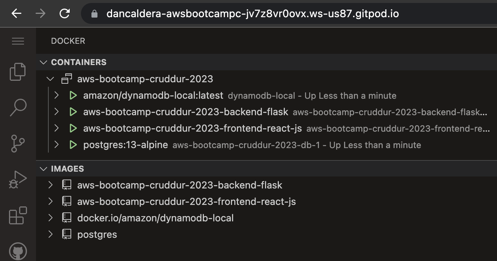

# Week 1 — App Containerization

## Technical Tasks

### Create the Github Repository

I created the repository from the template provided by the bootcamp.

### Launch the repo within a Gitpod workspace

Launched the repo within a Gitpod workspace without any problems.

### Configure Gitpod.yml configuration, eg. VSCode Extensions

I added the tasks on the gitpod.yml file to install the extensions (docker, postgres viewer) and the postgresql database.

### Clone the frontend and backend repo

Did this since the beginning of the bootcamp.

### Explore the codebases

I explored the codebases and I understood the structure of the project, following the week 1 video instructions.

### Ensure we can get the apps running locally

Run the python app locally without any problems, using the commands for flask and for the frontend application (npm start).

Is very convenient to use the gitpod terminal to run the commands, because all the dependencies are already installed.

### Write a Dockerfile for each app

I wrote the Dockerfile for the frontend and the backend, following the instructions of the week 1 video.

### Ensure we get the apps running via individual containers

I got the apps running via individual containers, using the Dockerfile's for the frontend and the backend.

### Create a docker-compose file

I created the docker-compose file, following the instructions of the week 1 video, to run the frontend and the backend, and the postgresql and dynamodb databases as well.



### Mount directories so we can make changes while we code

I mounted the directories (volumes) so we can make changes while we code, maybe is missing some configuration to the flask application to work properly, maybe just changing the CMD while the projects is in development, following the instructions of the week 1 video.


# From here it's just references and notes from Andrew Brown
## Week 1 — App Containerization

## References

Good Article for Debugging Connection Refused
https://pythonspeed.com/articles/docker-connection-refused/


## VSCode Docker Extension

Docker for VSCode makes it easy to work with Docker

https://code.visualstudio.com/docs/containers/overview

> Gitpod is preinstalled with theis extension

## Containerize Backend

### Run Python

```sh
cd backend-flask
export FRONTEND_URL="*"
export BACKEND_URL="*"
python3 -m flask run --host=0.0.0.0 --port=4567
cd ..
```

- make sure to unlock the port on the port tab
- open the link for 4567 in your browser
- append to the url to `/api/activities/home`
- you should get back json


### Add Dockerfile

Create a file here: `backend-flask/Dockerfile`

```dockerfile
FROM python:3.10-slim-buster

WORKDIR /backend-flask

COPY requirements.txt requirements.txt
RUN pip3 install -r requirements.txt

COPY . .

ENV FLASK_ENV=development

EXPOSE ${PORT}
CMD [ "python3", "-m" , "flask", "run", "--host=0.0.0.0", "--port=4567"]
```

### Build Container

```sh
docker build -t  backend-flask ./backend-flask
```

### Run Container

Run 
```sh
docker run --rm -p 4567:4567 -it backend-flask
FRONTEND_URL="*" BACKEND_URL="*" docker run --rm -p 4567:4567 -it backend-flask
export FRONTEND_URL="*"
export BACKEND_URL="*"
docker run --rm -p 4567:4567 -it -e FRONTEND_URL='*' -e BACKEND_URL='*' backend-flask
docker run --rm -p 4567:4567 -it  -e FRONTEND_URL -e BACKEND_URL backend-flask
unset FRONTEND_URL="*"
unset BACKEND_URL="*"
```

Run in background
```sh
docker container run --rm -p 4567:4567 -d backend-flask
```

Return the container id into an Env Vat
```sh
CONTAINER_ID=$(docker run --rm -p 4567:4567 -d backend-flask)
```

> docker container run is idiomatic, docker run is legacy syntax but is commonly used.

### Get Container Images or Running Container Ids

```
docker ps
docker images
```


### Send Curl to Test Server

```sh
curl -X GET http://localhost:4567/api/activities/home -H "Accept: application/json" -H "Content-Type: application/json"
```

### Check Container Logs

```sh
docker logs CONTAINER_ID -f
docker logs backend-flask -f
docker logs $CONTAINER_ID -f
```

###  Debugging  adjacent containers with other containers

```sh
docker run --rm -it curlimages/curl "-X GET http://localhost:4567/api/activities/home -H \"Accept: application/json\" -H \"Content-Type: application/json\""
```

busybosy is often used for debugging since it install a bunch of thing

```sh
docker run --rm -it busybosy
```

### Gain Access to a Container

```sh
docker exec CONTAINER_ID -it /bin/bash
```

> You can just right click a container and see logs in VSCode with Docker extension

### Delete an Image

```sh
docker image rm backend-flask --force
```

> docker rmi backend-flask is the legacy syntax, you might see this is old docker tutorials and articles.

> There are some cases where you need to use the --force

### Overriding Ports

```sh
FLASK_ENV=production PORT=8080 docker run -p 4567:4567 -it backend-flask
```

> Look at Dockerfile to see how ${PORT} is interpolated

## Containerize Frontend

## Run NPM Install

We have to run NPM Install before building the container since it needs to copy the contents of node_modules

```
cd frontend-react-js
npm i
```

### Create Docker File

Create a file here: `frontend-react-js/Dockerfile`

```dockerfile
FROM node:16.18

ENV PORT=3000

COPY . /frontend-react-js
WORKDIR /frontend-react-js
RUN npm install
EXPOSE ${PORT}
CMD ["npm", "start"]
```

### Build Container

```sh
docker build -t frontend-react-js ./frontend-react-js
```

### Run Container

```sh
docker run -p 3000:3000 -d frontend-react-js
```

## Multiple Containers

### Create a docker-compose file

Create `docker-compose.yml` at the root of your project.

```yaml
version: "3.8"
services:
  backend-flask:
    environment:
      FRONTEND_URL: "https://3000-${GITPOD_WORKSPACE_ID}.${GITPOD_WORKSPACE_CLUSTER_HOST}"
      BACKEND_URL: "https://4567-${GITPOD_WORKSPACE_ID}.${GITPOD_WORKSPACE_CLUSTER_HOST}"
    build: ./backend-flask
    ports:
      - "4567:4567"
    volumes:
      - ./backend-flask:/backend-flask
  frontend-react-js:
    environment:
      REACT_APP_BACKEND_URL: "https://4567-${GITPOD_WORKSPACE_ID}.${GITPOD_WORKSPACE_CLUSTER_HOST}"
    build: ./frontend-react-js
    ports:
      - "3000:3000"
    volumes:
      - ./frontend-react-js:/frontend-react-js

# the name flag is a hack to change the default prepend folder
# name when outputting the image names
networks: 
  internal-network:
    driver: bridge
    name: cruddur
```

## Adding DynamoDB Local and Postgres

We are going to use Postgres and DynamoDB local in future labs
We can bring them in as containers and reference them externally

Lets integrate the following into our existing docker compose file:

### Postgres

```yaml
services:
  db:
    image: postgres:13-alpine
    restart: always
    environment:
      - POSTGRES_USER=postgres
      - POSTGRES_PASSWORD=password
    ports:
      - '5432:5432'
    volumes: 
      - db:/var/lib/postgresql/data
volumes:
  db:
    driver: local
```

To install the postgres client into Gitpod

```sh
  - name: postgres
    init: |
      curl -fsSL https://www.postgresql.org/media/keys/ACCC4CF8.asc|sudo gpg --dearmor -o /etc/apt/trusted.gpg.d/postgresql.gpg
      echo "deb http://apt.postgresql.org/pub/repos/apt/ `lsb_release -cs`-pgdg main" |sudo tee  /etc/apt/sources.list.d/pgdg.list
      sudo apt update
      sudo apt install -y postgresql-client-13 libpq-dev
```

to run psql locally
```sh
psql -h localhost -U postgres
```

### DynamoDB Local

```yaml
services:
  dynamodb-local:
    # https://stackoverflow.com/questions/67533058/persist-local-dynamodb-data-in-volumes-lack-permission-unable-to-open-databa
    # We needed to add user:root to get this working.
    user: root
    command: "-jar DynamoDBLocal.jar -sharedDb -dbPath ./data"
    image: "amazon/dynamodb-local:latest"
    container_name: dynamodb-local
    ports:
      - "8000:8000"
    volumes:
      - "./docker/dynamodb:/home/dynamodblocal/data"
    working_dir: /home/dynamodblocal
```

Example of using DynamoDB local
https://github.com/100DaysOfCloud/challenge-dynamodb-local

## Volumes

directory volume mapping

```yaml
volumes: 
- "./docker/dynamodb:/home/dynamodblocal/data"
```

named volume mapping

```yaml
volumes: 
  - db:/var/lib/postgresql/data

volumes:
  db:
    driver: local
```


psql -h localhost -U postgres